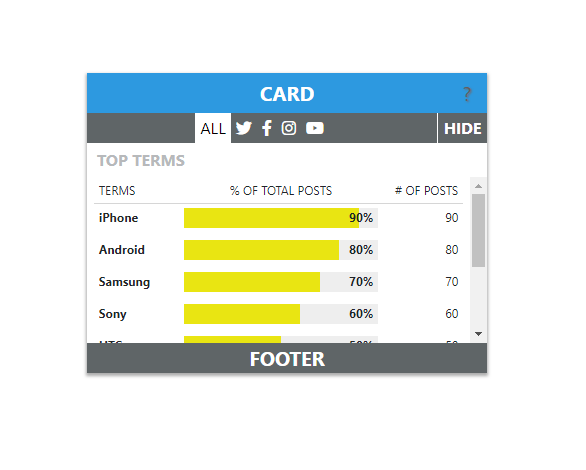

## Available Scripts

In the project directory, you can run:

### `yarn start`

git clone and run `yarn start` in project folder
Open [http://localhost:3000](http://localhost:3000) to view it in the browser.

#### view:

## Demo

CodeSandBox Link: in progress

